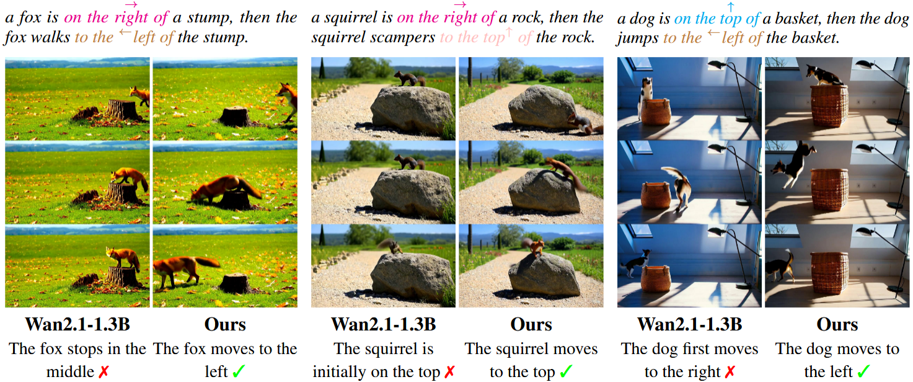

# SpatialAlign: Aligning Dynamic Spatial Relationships in Video Generation

<p align="center">
  <!-- 可放 teaser 图 / pipeline 图 -->
  
</p>

<p align="center">
  <!-- 徽章：论文/项目页/许可证/Stars 等 -->
  <a href="<paper>"></a>
  <a href="https://fengming001ntu.github.io/SpatialAlign/"></a>
</p>

---

## 📌 Overview
Most text-to-video (T2V) generators prioritize aesthetic quality, but often ignoring the spatial constraints in the generated videos. In this work, we present SPATIALALIGN, a self-improvement framework that enhances T2V models’ capabilities to depict Dynamic Spatial Relationships (DSR) specified in text prompts. We present a zeroth-order regularized Direct Preference Optimization (DPO) to fine-tune T2V models towards better alignment with DSR. Specifically, we design DSR-SCORE, a geometry-based metric that quantitatively measures the alignment between generated videos and the specified DSRs in prompts, which is a step forward from prior works that rely on VLM for evaluation. We also conduct a dataset of text-video pairs with diverse DSRs to facilitate the study. Extensive experiments demonstrate that our fine-tuned model significantly outperforms the baseline in spatial relationships. 

---

## ⚙️ Setup

### Install Environment
Basic setting:
```bash
conda create -n spatialalign python=3.10
conda activate spatialalign
pip install -r requirements.txt
```
Here we use a specific version of [DiffSynth-Studio](https://github.com/modelscope/DiffSynth-Studio/tree/main):
```bash
unzip DiffSynth-Studio-bf81de0c881b7beffc60d4e6ace0e69a2915d51b.zip
mv DiffSynth-Studio-bf81de0c881b7beffc60d4e6ace0e69a2915d51b DiffSynth-Studio
pip install -e DiffSynth-Studio
```


### Model
Please follow [Wan2.1](https://github.com/Wan-Video/Wan2.1) to download Wan2.1-1.3B. We use the ModelScope version by default.

### Training
📥 **Training data (tensors + metadata)**: [OneDrive](https://entuedu-my.sharepoint.com/:f:/g/personal/fengming001_e_ntu_edu_sg/IgCz3bCNT5WLRpCaqvvaIiLBAbNXp3lpfXNBjROqfp4UM3k?e=6dz89e)

Put the model, tensors and metadata to the directories according to `run_train.sh`. 
```bash
bash run_train.sh
```

### Inference
The necessary settings are included in `run_inference.sh`. The LoRA checkpoint is also in [OneDrive](https://entuedu-my.sharepoint.com/:f:/g/personal/fengming001_e_ntu_edu_sg/IgCz3bCNT5WLRpCaqvvaIiLBAbNXp3lpfXNBjROqfp4UM3k?e=6dz89e).
```bash
bash run_inference.sh
```

### Evaluation
Install [Grounded-SAM-2](https://github.com/IDEA-Research/Grounded-SAM-2)
```bash
bash run_detection.sh
bash run_calc_dsr.sh
```


---
